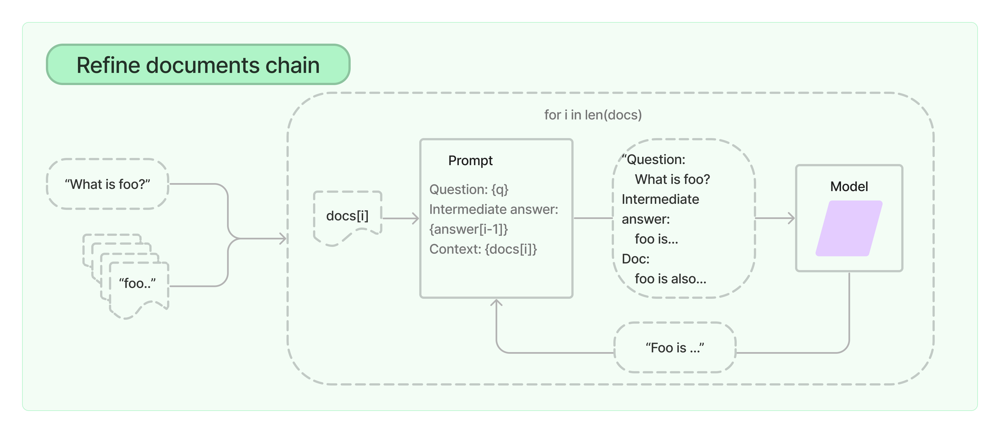

# Github Automated Analysis

This tool helps rate you your repos and ranks them based on complexity.

# How to run this?

`bash run.sh`

After running this go to `localhost:8501` in your browser.

# Methodology

There were choices that were made while designing the app. We may go into them further in following sections. 

There are following steps

1. Enter your user name

2. The app will download and cache your repos onto local storage.

3. **Preprocessing** Then app will concatenate all files into one single text file, which is then fed into `ChatOpenAI()` llm. For notebooks, we only take code and markdown cells (as comments). 

4. Since this *single text file* will be large than model context, we use **map_reduce** methodology from langchain.

There are two main methods available in lanchain
    
1. Map Reduce: The map reduce documents chain first applies an LLM chain to each document individually (the Map step), treating the chain output as a new document. It then passes all the new documents to a separate combine documents chain to get a single output (the Reduce step). It can optionally first compress, or collapse, the mapped documents to make sure that they fit in the combine documents chain (which will often pass them to an LLM). This compression step is performed recursively if necessary.


2. Refine: The "Refine documents chain" iteratively updates its answer by looping over input documents and passing them to an LLM chain. This chain is suitable for tasks with multiple documents but makes more LLM calls than other chains. However, it may struggle with cross-referencing documents or tasks needing detailed information from many documents.




5. Each code base is accessed on the following qualities
    1. Cyclomatic complexity
    2. Nesting depth
    3. Code duplication
    4. Code coupling
    5. Code readability
    6. Code maintanibility
    7. Proper documentation
    8. Proper function doc strings
    9. Proper maintained readme.
    10. Num Lines (approx.)

6. Once we have these scores from 0-10 on above qualities, we combine results from all the chunks and take average of them. This gives us a quantitative features to access the code on.

7. We the compute the final score as following

` score = (Cyclomatic complexity + Nesting depth + Code duplication + Code coupling + Code readability + Code maintanibility + Proper documentation + Proper function doc strings + Proper maintained readme) / 9 + (Num Lines) / max(Num Lines) `

8. At last we sort them in descending order of score and some popularity criteria (pulls_count, open_pulls_count, stars_count, closed_pulls_count, forks_count)

# Design Choices

1. Since this is just a demonstration app we have made some cheap approximations to save calls to ChatGpt. For e.g.

```python
if docs:
    output = chain(
        {"input_documents": docs[:20]}, return_only_outputs=True)
```

2. Caching Repos on local storage to save github api calls.

3. The server is tunneled from localhost though ngrok like app so as to save cost from deploying to some service provider.

